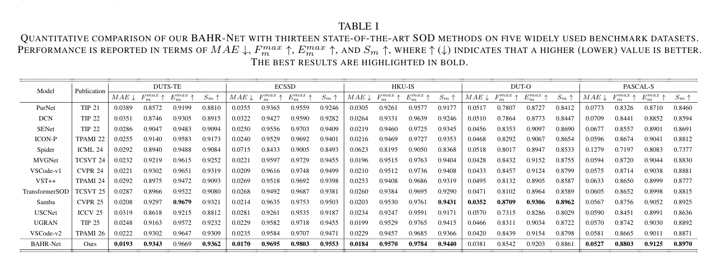
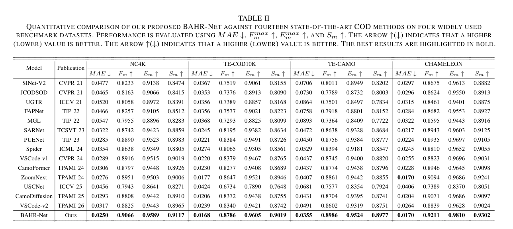
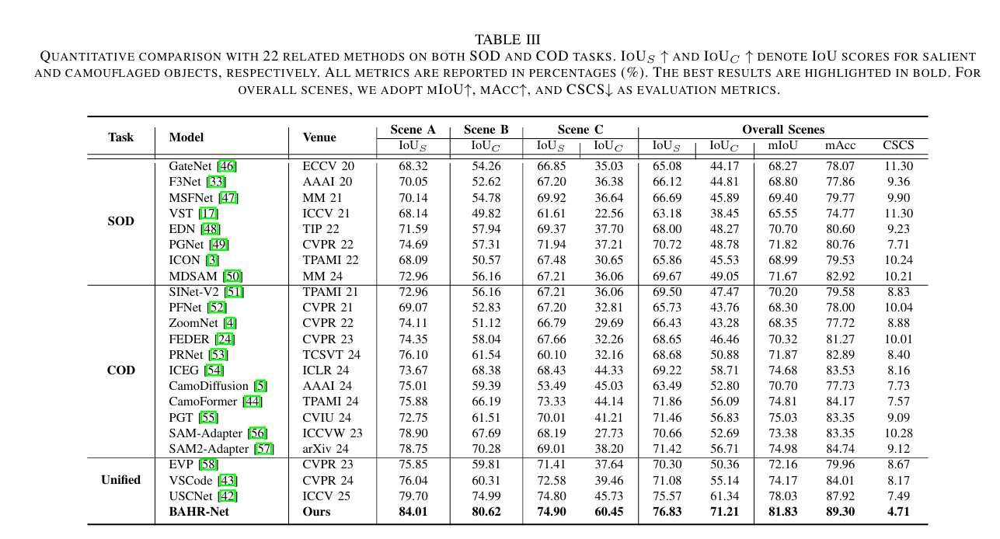
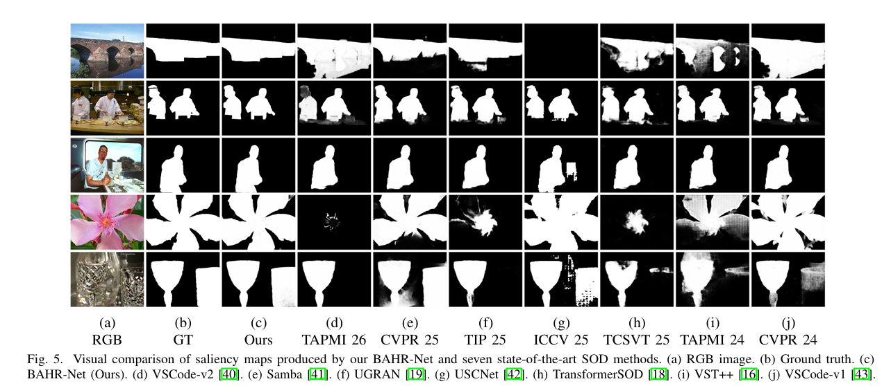
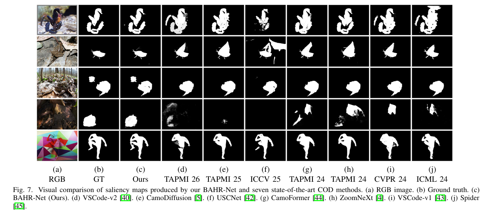

# DAHRNet

Joint salient / camouflaged object detection with BAHR-Net.

## Setup

```bash
pip install -r requirements.txt
```

### Train/Test

### Data Preparation

We provide [download link](https://pan.baidu.com/s/1D2VcNgngWD3udEapbUUs2g?pwd=euca) for the SOD dataset，[download link](https://pan.baidu.com/s/1wdK6RYHkk9FK97Stw6z8ew?pwd=35bn) for the COD dataset, [download link](https://pan.baidu.com/s/1TuTHbVL9AIRmxXU33_RJJQ?pwd=rsu8) for the USCOD dataset.


We randomly selected images from multiple test datasets for validation.

### Dataset Structure

```
dataset/
├─SOD_dataset/
│ ├─train/
│ │ ├─DUTS-TR/
│ │ ├─...
│ └─test/
│   ├─PASCAL-S/
│   ├─DUTS-TE/
│   ├─...
└─COD_dataset/
  ├─train/
  │ ├─COD10K-TR/
│   ├─...
  └─test/
    ├─TE-CAMO/
    ├─TE-COD10K/
    ├─...
```
The structure of each dataset is shown below
```
TE-CAMO/
├─bound/
├─GT/
├─RGB/
├─...
```

For USCOD's dataset partitioning strategy, see [link](https://github.com/ssecv/USCNet)


Place datasets under `./dataset` (or symlink) and backbone weights under `./pretrained/ckpts`. YAML configs in `pretrained/configs/` are already included.

## Train

```bash
bash scripts/run_joint.sh
```

Or launch distributed training directly:

```bash
CUDA_VISIBLE_DEVICES=0,1,2,3 python -m torch.distributed.launch --nproc_per_node=4 joint_train_s1_fullcedice.py \
  --backbone convnextv2-base --optim_preset step_adam_simple \
  --pretrain_batch 60 --finetune_batch 8 --mfusion LSF \
  --log_path ./log/ --pretrain_size 384 --finetune_size 576
```

## Test

### model and log

```
path/to/log/
├─record/
├─args.json
├─config.yaml
└─ckpt/#checkpoints
```

```bash
python joint_test.py --log_path path/to/ckpt
```

* **Salmaps**   

The salmaps of the above datasets can be download from [SOD-here](https://pan.baidu.com/s/1fsfxARs35R-OB2FQDS-s7A?pwd=s45n) and [COD-here](https://pan.baidu.com/s/1yBSk2xwBymJmRp2xUvySeQ?pwd=tna7) and [USCOD-here](https://pan.baidu.com/s/1PXAZsXxAsWj7WCYXa9d6Sg?pwd=ykjt).

## Evaluation and Visual Analysis

refer to [SOD_Evaluation_Metrics](https://github.com/zyjwuyan/SOD_Evaluation_Metrics)

## Results
* **Qualitative comparison**  



Fig.1 Qualitative comparison of our proposed method with some SOD SOTA methods.  



Fig.2 Qualitative comparison of our proposed method with some COD SOTA methods.



Fig.2 Qualitative comparison of our proposed method with some USCOD SOTA methods.

* **Quantitative comparison** 



Table.1 Quantitative comparison with some SOTA models on some public SOD benchmark datasets. 



Table.2 Quantitative comparison with some SOTA models on some public COD benchmark datasets. 

## License

MIT
